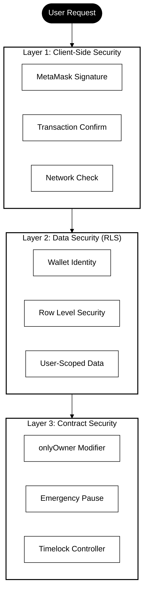
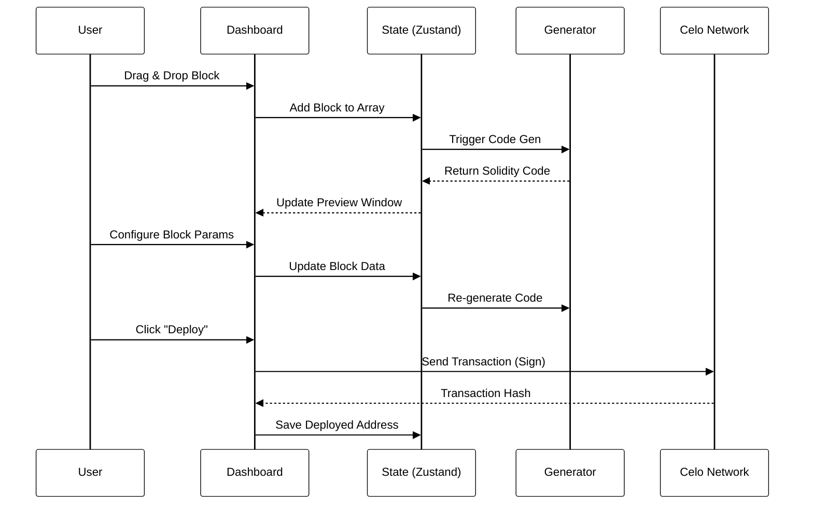
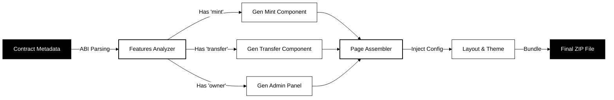

# 🏗️ Block Builder Architecture

This document provides a deep dive into the technical architecture, data flow, and improving the developer experience with the Celo blockchain.

---

## 1. System Architecture

A high-level overview of how the Frontend, Backend, Data Layer, and Blockchain interact.

```mermaid
%%{init: {'theme':'base', 'themeVariables': {'primaryColor':'#fff','primaryTextColor':'#000','primaryBorderColor':'#000','lineColor':'#000','secondaryColor':'#fff','tertiaryColor':'#fff'}}}%%
graph TD
    subgraph Client["🖥️ Client Layer (Next.js)"]
        UI[Web Dashboard]
        Gen[Code Generator]
        Wallet[Wallet Interface]
    end

    subgraph Server["⚙️ Backend Layer (API Routes)"]
        API[Target: /api/compile]
        Compiler[Solidity Compiler (solc)]
    end

    subgraph Data["💾 Persistence Layer"]
        DB[(Supabase DB)]
        Cache[Local Storage / Zustand]
    end

    subgraph Blockchain["⛓️ Celo Network"]
        RPC[RPC Nodes (Alchemy/Forno)]
        SC[Smart Contracts]
    end

    Client -->|User Action| UI
    UI -->|State Updates| Cache
    UI -->|Sync Project| DB
    
    UI -->|Request Compile| API
    API -->|Compile Source| Compiler
    Compiler -->> API: Bytecode & ABI
    API -->> UI: Compilation Result

    Wallet -->|Sign & Send| SC
    UI -->|Read State| RPC
    RPC --> SC
    
    style Client fill:#fff,stroke:#000,stroke-width:2px,color:#000
    style Server fill:#fff,stroke:#000,stroke-width:2px,color:#000
    style Data fill:#fff,stroke:#000,stroke-width:2px,color:#000
    style Blockchain fill:#fff,stroke:#000,stroke-width:2px,color:#000
```

---

## 2. Security Architecture

Detailed view of the three-layer security model ensuring safe interactions and data integrity.



---

## 3. Data Flow

Visualizing how data moves from user input to blockchain state.



---

## 4. Frontend Generation Flow

How the platform generates a Production-Ready Next.js App from a Smart Contract.



---

## 5. Supported Blocks Description

Detailed breakdown of the 17 smart contract building blocks available in the platform.

### Base Contracts
- **ERC20 Token:** Standard fungible token implementation with name, symbol, and decimals.
- **NFT (ERC721):** Non-fungible token standard for unique digital assets.

### Core Features
- **Mint:** Allows creation of new tokens. Includes `onlyOwner` protection by default.
- **Burn:** Allows holders to destroy their tokens, reducing total supply.
- **Transfer:** Enhanced transfer function with hooks for before/after token movement.

### DeFi Components
- **Stake:** logic for users to lock tokens and earn rewards (or track staking duration).
- **Withdraw:** Secure extraction of staked assets or contract funds.

### Security Modules
- **Pausable:** Emergency stop mechanism to freeze contract interactions.
- **Whitelist:** Restricts actions (like minting) to specific addresses.
- **Blacklist:** Prevents specific malicious addresses from interacting.
- **Multi-Signature:** Requires multiple approvals for critical actions.
- **Timelock:** Enforces a delay between action proposal and execution (anti-rug pull).

### Advanced Functionality
- **Royalties:** ERC2981 standard for NFT secondary market royalties.
- **Airdrop:** Batch transfer utility to send tokens to multiple addresses in one transaction.
- **Voting:** Governance mechanism for proposal creation and voting.
- **Snapshot:** Records token balances at a specific block height for governance or rewards.
- **Gasless Approval (Permit):** EIP-2612 implementation allowing approvals via signatures (saving gas).

---

## 6. Why Celo?

We chose **Celo** as the exclusive blockchain for this platform for three strategic reasons:

### 🌍 Mobile-First & Accessible
Celo's mobile-first approach aligns perfectly with our "Low/No-Code" mission to democratize blockchain access. By building on Celo, we enable users to create dApps that are accessible to anyone with a smartphone, not just desktop users with complex wallets.

### 🌱 Carbon-Negative & Sustainable
Sustainability is a core value. Celo is carbon-negative, making it the ideal choice for grant projects that prioritize environmental impact. Every contract deployed via Block Builder contributes to a greener web3 ecosystem.

### ⚡ EVM Compatibility & Speed
Celo's full EVM compatibility allows us to leverage standard Solidity tools (solc, ethers.js) while benefiting from Celo's sub-5 second block times and negligible gas fees. This ensures a snappy, "web2-like" user experience for our platform's builders.
