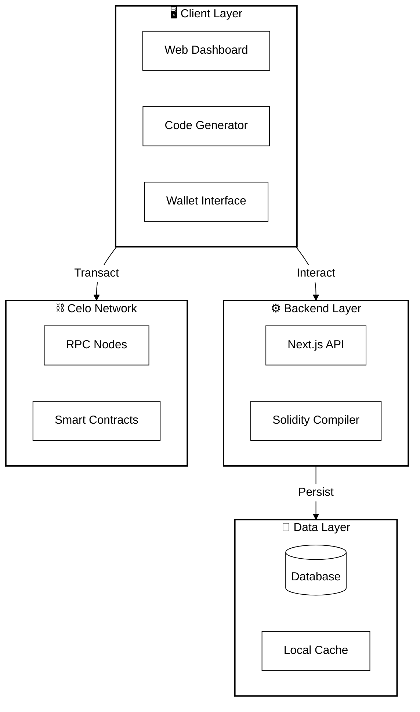

<div align="center">
  
  
  
  # 🚀 Block Builder
  
  ### *Generate production-ready Next.js frontends from smart contract ABIs in seconds*
  
  **🌐 [Live Demo](https://celobuilder.vercel.app/) • [Builder](https://celobuilder.vercel.app/builder)**
  
  [](https://nextjs.org/)
  [](https://www.typescriptlang.org/)
  [](https://tailwindcss.com/)
  [](https://celo.org/)
  
  
  
  
  [Features](#-features) •
  [Quick Start](#-quick-start) •
  [Architecture](#-architecture) •
  [Examples](#-examples)
  
</div>

---

## 🎥 Demo Video

[](https://youtu.be/-GR1HKnp26Q)

**[Watch the full demonstration →](https://youtu.be/-GR1HKnp26Q)**

---

## 📸 Screenshots

<div align="center">

### 🏠 Landing Page


---

### 🛠️ Builder Interface


---

### 📦 Project Section


</div>

---

## 📖 About

**Block Builder** is an intelligent no-code/low-code platform that automatically generates fully-functional Next.js dApps from your smart contract ABIs. Deploy a contract, paste the ABI, and get a production-ready frontend with wallet integration, transaction handling, and beautiful UI.

### 🎯 Value Proposition

| Traditional Development | With Block Builder |
| ----------------------- | ------------------ |
| ⏰ Days of coding       | ⚡ Minutes         |
| 🔧 Manual ABI parsing   | 🤖 Auto-detection  |
| 🎨 Build UI from scratch| ✨ Beautiful UI    |
| 🔌 Setup wallet         | 🔗 Pre-integrated  |
| 📝 Write ethers.js code | 📦 Production code |

### 🏆 Key Metrics

| Metric | Value |
|--------|-------|
| ⚡ **Generation Time** | < 5 seconds |
| 📦 **Files Generated** | 10+ ready-to-use files |
| 🔍 **Supported Blocks** | 17 smart contract types |
| 🌐 **Networks** | Celo Mainnet & Alfajores |

---

## ✨ Features

### 🎨 ABI-Aware Generation
- Automatically detects function signatures
- Generates UI components only for functions present in your contract
- **17 Supported Block Types:** ERC20, NFT, Mint, Burn, Stake, Withdraw, Pausable, Whitelist, Blacklist, Multi-Signature, Time Lock, Royalties, Airdrop, Voting, Snapshot, Gasless Approval

### 🔌 Dual Provider Architecture
- **Primary**: MetaMask Browser Provider
- **Fallback**: Alchemy RPC Provider
- Automatic network switching

### 🔍 Transaction Verification
- Real-time transaction tracking
- Celoscan API integration
- Direct links to block explorer

### 🎨 Professional UI
- Pre-configured Tailwind CSS with dark theme
- Responsive design
- Smooth transitions and effects

---

## 🗺️ User Journey: From Idea to DApp


### 🛣️ Step-by-Step

1. **Connect** your Celo-compatible wallet (MetaMask, Valora, etc.)
2. **Build** your contract using the visual drag-and-drop interface
3. **Configure** parameters (name, symbol, supply, features)
4. **Generate** Solidity code automatically in real-time
5. **Deploy** directly to Celo Blockchain (one-click deployment)
6. **Download** your complete Next.js application
7. **Launch** your DApp to production!

---

## 🚀 Quick Start

### Prerequisites
- ✅ Node.js 18+
- ✅ MetaMask or Web3 wallet

### Try It Online

**🌐 [https://celobuilder.vercel.app/](https://celobuilder.vercel.app/)**

### Run Locally

```powershell
# Clone repository
git clone https://github.com/ROHIT8759/Low_-_No_Code_Platform_on_CELO.git
cd Low_-_No_Code_Platform_on_CELO

# Install and run
npm install
npm run dev
```

🎉 Open **http://localhost:3000**

---

## 🎯 How to Use

### Step 1: Access the Builder
- **Online:** [celobuilder.vercel.app/builder](https://celobuilder.vercel.app/builder)
- **Local:** http://localhost:3000/builder

### Step 2: Generate Frontend

<table>
<tr>
<td width="50%">

**Via UI**
1. Paste contract ABI
2. Enter contract address
3. Select network
4. Download ZIP

</td>
<td width="50%">

**Programmatically**
```typescript
import { generateNextJsFrontend } 
  from './lib/frontend-generator'

const files = generateNextJsFrontend({
  contractName: 'MyToken',
  contractAddress: '0x...',
  abi: [...],
  chainId: 44787
})
```

</td>
</tr>
</table>

### Step 3: Deploy

```powershell
cd mytoken-frontend
npm install
npm run dev
```

---

## 🏗️ Architecture

For a detailed deep-dive into the technical architecture, security layers, data flow diagrams, and internal components, please refer to the dedicated documentation:

👉 **[Read Full Architecture Documentation](./ARCHITECTURE.md)**

### System Overview (High-Level)



---

## 🔧 Tech Stack

| Layer | Technology |
|-------|------------|
| **Framework** | Next.js 15 with App Router |
| **Language** | TypeScript 5+ |
| **Styling** | Tailwind CSS 3 |
| **Blockchain** | ethers.js 6 |
| **State** | Zustand (with persist) |
| **Database** | Supabase (PostgreSQL) |
| **RPC Provider** | Alchemy API / Forno |
| **Block Explorer** | Celoscan API |
| **Compiler** | solc (Solidity Compiler) |

---

## 📋 Supported Block Types

All 17 smart contract block types:

| Block | Category | Functions |
|-------|----------|-----------|
| **ERC20** | Base | `transfer()`, `approve()`, `balanceOf()`, etc. |
| **NFT** | Base | `mint()`, `transferFrom()`, `tokenURI()`, etc. |
| **Mint** | Token | `mint(address, uint256)` with `onlyOwner` |
| **Transfer** | Token | Enhanced transfer with hooks |
| **Burn** | Token | `burn()`, `burnFrom()` |
| **Stake** | DeFi | `stake()`, `getStake()`, `totalStaked()` |
| **Withdraw** | DeFi | `withdraw()`, `withdrawAll()` |
| **Pausable** | Security | `pause()`, `unpause()` |
| **Whitelist** | Security | `addToWhitelist()`, `removeFromWhitelist()` |
| **Blacklist** | Security | `addToBlacklist()`, `removeFromBlacklist()` |
| **Multisig** | Security | Multi-signature transaction control |
| **Timelock** | Security | Delayed transaction execution |
| **Royalty** | NFT | `setRoyalty()`, `royaltyInfo()` |
| **Airdrop** | Distribution | `airdrop()`, batch distribution |
| **Voting** | Governance | `createProposal()`, `vote()`, `execute()` |
| **Snapshot** | Governance | `createSnapshot()`, `balanceOfAt()` |
| **Permit** | Gas Optimization | EIP-2612 gasless approvals |

---

## 🎓 Examples

### Example 1: ERC-20 Token

**Contract Functions:**
- `mint(address, uint256)` ✅
- `burn(uint256)` ✅
- `transfer(address, uint256)` ✅

**Generated UI:**
- Amount input for minting
- Burn tokens interface
- Transfer form
- Real-time balance display

### Example 2: NFT Contract

**Contract Functions:**
- `mint(address)` ✅
- `tokenURI(uint256)` ✅
- `balanceOf(address)` ✅

**Generated UI:**
- Simple mint button
- NFT balance counter
- Metadata viewer

---

## 🚦 Roadmap

- [x] ABI-aware function generation
- [x] Dual provider (MetaMask + Alchemy)
- [x] Transaction verification
- [x] 17 smart contract block types
- [x] Cloud storage integration
- [x] Automated testing suite
- [ ] Event viewer component
- [ ] ERC-721 metadata display
- [ ] CI/CD pipeline

---

## 🤝 Contributing

Contributions welcome! Follow these steps:

1. 🍴 Fork the repository
2. 🌿 Create feature branch (`git checkout -b feature/amazing-feature`)
3. 💾 Commit changes (`git commit -m 'Add feature'`)
4. 📤 Push to branch (`git push origin feature/amazing-feature`)
5. 🎉 Open Pull Request

---

## 📝 License

This project is licensed under the MIT License.

---

## 🙏 Acknowledgments

- **Celo Foundation** for blockchain infrastructure
- **Alchemy** for reliable RPC endpoints
- **Celoscan** for block explorer APIs
- **Next.js Team** for the framework
- **ethers.js** for Ethereum interactions

---

## 📧 Support & Contact

- 🐛 **Issues**: [GitHub Issues](https://github.com/ROHIT8759/Low_-_No_Code_Platform_on_CELO/issues)
- 💬 **Discussions**: [GitHub Discussions](https://github.com/ROHIT8759/Low_-_No_Code_Platform_on_CELO/discussions)
- 📧 **Email**: Contact via GitHub profile

---

<div align="center">
  
  ### ⭐ Star this repo if you find it useful!
  
  Made with ❤️ for the Celo ecosystem
  
  [⬆ Back to Top](#-block-builder)
  
</div>
