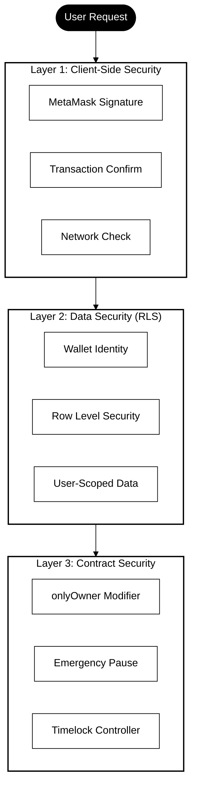
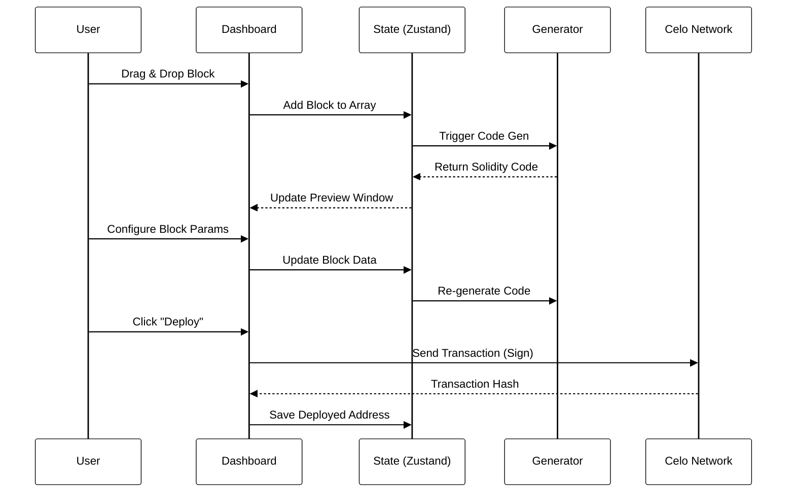
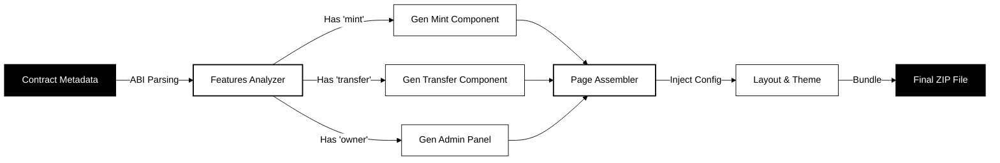

<div align="center">
  
  
  
  # 🚀 Block Builder
  
  > **AI-Powered • Visual Builder • One-Click Deployment** — Deploy your blockchain vision faster than ever
  
  **[🌐 Live Demo](https://celobuilder.vercel.app/) • [🛠️ Builder](https://celobuilder.vercel.app/builder) • [📖 Docs](https://celobuilder.vercel.app/docs)**
  
  [](https://nextjs.org/)
  [](https://www.typescriptlang.org/)
  [](https://tailwindcss.com/)
  [](https://celo.org/)
  
  
  
  
  [Features](#-features) •
  [Architecture](#-architecture) •
  [Examples](#-examples) •
  [Tech Stack](#-tech-stack)
  
</div>

---

## � What is Block Builder?

**Block Builder** is a revolutionary no-code/low-code platform that eliminates the barrier between your smart contracts and user-facing applications. Instead of writing weeks of code, paste your contract ABI and get a fully functional, production-ready Next.js dApp in **under 5 seconds**.

### 🎁 What You Get

```
Your Smart Contract  ──▶  [Block Builder Magic]  ──▶  Production-Ready dApp
    (Any ABI)                (5 seconds)              (MetaMask integrated)
                                                      (Tailwind styled)
                                                      (Deploy ready)
```

### 🌟 Key Promises

| Promise | Reality |
|---------|---------|
| **"It's too hard to build dApp UIs"** | ✅ Auto-generated & beautiful |
| **"Wallet integration is complex"** | ✅ Pre-integrated MetaMask + Alchemy |
| **"I don't know ethers.js"** | ✅ Code generated for you |
| **"Testing takes forever"** | ✅ Ready-to-test components |
| **"Deployment is scary"** | ✅ Click → Deploy → Live |

---

## 🎥 See It In Action

[](https://youtu.be/-GR1HKnp26Q)

**[Watch the full demonstration →](https://youtu.be/-GR1HKnp26Q)**

---

## 📸 Screenshots

<div align="center">

### 🏠 Landing Page


---

### 🛠️ Builder Interface


---

### 📦 Project Section


</div>

---

## 📖 About

**Block Builder** is an intelligent no-code/low-code platform that automatically generates fully-functional Next.js dApps from your smart contract ABIs. Deploy a contract, paste the ABI, and get a production-ready frontend with wallet integration, transaction handling, and beautiful UI.

### 🎯 Value Proposition

| Traditional Development | With Block Builder |
| ----------------------- | ------------------ |
| ⏰ Days of coding       | ⚡ Minutes         |
| 🔧 Manual ABI parsing   | 🤖 Auto-detection  |
| 🎨 Build UI from scratch| ✨ Beautiful UI    |
| 🔌 Setup wallet         | 🔗 Pre-integrated  |
| 📝 Write ethers.js code | 📦 Production code |

### 🏆 Key Metrics

| Metric | Value |
|--------|-------|
| ⚡ **Generation Time** | < 5 seconds |
| 📦 **Files Generated** | 10+ ready-to-use files |
| 🔍 **Supported Blocks** | 17 smart contract types |
| 🌐 **Networks** | Celo Mainnet & Alfajores |

---

## ✨ Features

### 🎨 ABI-Aware Generation
- Automatically detects function signatures
- Generates UI components only for functions present in your contract
- **17 Supported Block Types:** ERC20, NFT, Mint, Burn, Stake, Withdraw, Pausable, Whitelist, Blacklist, Multi-Signature, Time Lock, Royalties, Airdrop, Voting, Snapshot, Gasless Approval

### 🔌 Dual Provider Architecture
- **Primary**: MetaMask Browser Provider
- **Fallback**: Alchemy RPC Provider
- Automatic network switching

### 🔍 Transaction Verification
- Real-time transaction tracking
- Celoscan API integration
- Direct links to block explorer

### 🎨 Professional UI
- Pre-configured Tailwind CSS with dark theme
- Responsive design
- Smooth transitions and effects

---

## 🗺️ User Journey: From Idea to DApp


### 🛣️ Step-by-Step

1. **Connect** your Celo-compatible wallet (MetaMask, Valora, etc.)
2. **Build** your contract using the visual drag-and-drop interface
3. **Configure** parameters (name, symbol, supply, features)
4. **Generate** Solidity code automatically in real-time
5. **Deploy** directly to Celo Blockchain (one-click deployment)
6. **Download** your complete Next.js application
7. **Launch** your DApp to production!

---

## 📖 How to Use Block Builder

### Access the Platform

**🌐 [https://celobuilder.vercel.app/](https://celobuilder.vercel.app/)**

### Generate Frontend

<table>
<tr>
<td width="50%">

**Via UI**
1. Paste contract ABI
2. Enter contract address
3. Select network
4. Download ZIP

</td>
<td width="50%">

**Programmatically**
```typescript
import { generateNextJsFrontend } 
  from './lib/frontend-generator'

const files = generateNextJsFrontend({
  contractName: 'MyToken',
  contractAddress: '0x...',
  abi: [...],
  chainId: 44787
})
```

</td>
</tr>
</table>

---

## 🏗️ Architecture

<details>
<summary><b>🔍 Architecture Deep Dive (Click to Expand)</b></summary>

<br>

### 1. System Architecture

A high-level overview of how the Frontend, Backend, Data Layer, and Blockchain interact.

```mermaid
%%{init: {'theme':'base', 'themeVariables': {'primaryColor':'#fff','primaryTextColor':'#000','primaryBorderColor':'#000','lineColor':'#000','secondaryColor':'#fff','tertiaryColor':'#fff'}}}%%
graph TD
    subgraph Client["🖥️ Client Layer (Next.js)"]
        UI[Web Dashboard]
        Gen[Code Generator]
        Wallet[Wallet Interface]
    end

    subgraph Server["⚙️ Backend Layer (API Routes)"]
        API[Target: /api/compile]
        Compiler[Solidity Compiler (solc)]
    end

    subgraph Data["💾 Persistence Layer"]
        DB[(Supabase DB)]
        Cache[Local Storage / Zustand]
    end

    subgraph Blockchain["⛓️ Celo Network"]
        RPC[RPC Nodes (Alchemy/Forno)]
        SC[Smart Contracts]
    end

    Client -->|User Action| UI
    UI -->|State Updates| Cache
    UI -->|Sync Project| DB
    
    UI -->|Request Compile| API
    API -->|Compile Source| Compiler
    Compiler -->> API: Bytecode & ABI
    API -->> UI: Compilation Result

    Wallet -->|Sign & Send| SC
    UI -->|Read State| RPC
    RPC --> SC
    
    style Client fill:#fff,stroke:#000,stroke-width:2px,color:#000
    style Server fill:#fff,stroke:#000,stroke-width:2px,color:#000
    style Data fill:#fff,stroke:#000,stroke-width:2px,color:#000
    style Blockchain fill:#fff,stroke:#000,stroke-width:2px,color:#000
```

---

### 2. Security Architecture

Detailed view of the three-layer security model ensuring safe interactions and data integrity.



---

### 3. Data Flow

Visualizing how data moves from user input to blockchain state.



---

### 4. Frontend Generation Flow

How the platform generates a Production-Ready Next.js App from a Smart Contract.



---

### 5. Supported Blocks Description

Detailed breakdown of the 17 smart contract building blocks available in the platform.

#### Base Contracts
- **ERC20 Token:** Standard fungible token implementation with name, symbol, and decimals.
- **NFT (ERC721):** Non-fungible token standard for unique digital assets.

#### Core Features
- **Mint:** Allows creation of new tokens. Includes `onlyOwner` protection by default.
- **Burn:** Allows holders to destroy their tokens, reducing total supply.
- **Transfer:** Enhanced transfer function with hooks for before/after token movement.

#### DeFi Components
- **Stake:** Logic for users to lock tokens and earn rewards (or track staking duration).
- **Withdraw:** Secure extraction of staked assets or contract funds.

#### Security Modules
- **Pausable:** Emergency stop mechanism to freeze contract interactions.
- **Whitelist:** Restricts actions (like minting) to specific addresses.
- **Blacklist:** Prevents specific malicious addresses from interacting.
- **Multi-Signature:** Requires multiple approvals for critical actions.
- **Timelock:** Enforces a delay between action proposal and execution (anti-rug pull).

#### Advanced Functionality
- **Royalties:** ERC2981 standard for NFT secondary market royalties.
- **Airdrop:** Batch transfer utility to send tokens to multiple addresses in one transaction.
- **Voting:** Governance mechanism for proposal creation and voting.
- **Snapshot:** Records token balances at a specific block height for governance or rewards.
- **Gasless Approval (Permit):** EIP-2612 implementation allowing approvals via signatures (saving gas).

---

### 6. Why Celo?

We chose **Celo** as the exclusive blockchain for this platform for three strategic reasons:

#### 🌍 Mobile-First & Accessible
Celo's mobile-first approach aligns perfectly with our "Low/No-Code" mission to democratize blockchain access. By building on Celo, we enable users to create dApps that are accessible to anyone with a smartphone, not just desktop users with complex wallets.

#### 🌱 Carbon-Negative & Sustainable
Sustainability is a core value. Celo is carbon-negative, making it the ideal choice for grant projects that prioritize environmental impact. Every contract deployed via Block Builder contributes to a greener web3 ecosystem.

#### ⚡ EVM Compatibility & Speed
Celo's full EVM compatibility allows us to leverage standard Solidity tools (solc, ethers.js) while benefiting from Celo's sub-5 second block times and negligible gas fees. This ensures a snappy, "web2-like" user experience for our platform's builders.

</details>

---

## 🔧 Tech Stack

| Layer | Technology |
|-------|------------|
| **Framework** | Next.js 15 with App Router |
| **Language** | TypeScript 5+ |
| **Styling** | Tailwind CSS 3 |
| **Blockchain** | ethers.js 6 |
| **State** | Zustand (with persist) |
| **Database** | Supabase (PostgreSQL) |
| **RPC Provider** | Alchemy API / Forno |
| **Block Explorer** | Celoscan API |
| **Compiler** | solc (Solidity Compiler) |

---

## 📋 Supported Block Types

All 17 smart contract block types:

| Block | Category | Functions |
|-------|----------|-----------|
| **ERC20** | Base | `transfer()`, `approve()`, `balanceOf()`, etc. |
| **NFT** | Base | `mint()`, `transferFrom()`, `tokenURI()`, etc. |
| **Mint** | Token | `mint(address, uint256)` with `onlyOwner` |
| **Transfer** | Token | Enhanced transfer with hooks |
| **Burn** | Token | `burn()`, `burnFrom()` |
| **Stake** | DeFi | `stake()`, `getStake()`, `totalStaked()` |
| **Withdraw** | DeFi | `withdraw()`, `withdrawAll()` |
| **Pausable** | Security | `pause()`, `unpause()` |
| **Whitelist** | Security | `addToWhitelist()`, `removeFromWhitelist()` |
| **Blacklist** | Security | `addToBlacklist()`, `removeFromBlacklist()` |
| **Multisig** | Security | Multi-signature transaction control |
| **Timelock** | Security | Delayed transaction execution |
| **Royalty** | NFT | `setRoyalty()`, `royaltyInfo()` |
| **Airdrop** | Distribution | `airdrop()`, batch distribution |
| **Voting** | Governance | `createProposal()`, `vote()`, `execute()` |
| **Snapshot** | Governance | `createSnapshot()`, `balanceOfAt()` |
| **Permit** | Gas Optimization | EIP-2612 gasless approvals |

---

## 🎓 Examples & Use Cases

### Example 1: ERC-20 Token DApp

Perfect for tokenomics projects, community tokens, fundraising.

**Contract Functions:**
- `mint(address, uint256)` ✅
- `burn(uint256)` ✅
- `transfer(address, uint256)` ✅

**Generated UI:**
- Amount input for minting
- Burn tokens interface
- Transfer form
- Real-time balance display

### Example 2: NFT Contract

**Contract Functions:**
- `mint(address)` ✅
- `tokenURI(uint256)` ✅
- `balanceOf(address)` ✅

**Generated UI:**
- Simple mint button
- NFT balance counter
- Metadata viewer

---

## ❓ Frequently Asked Questions (FAQ)

<details>
<summary><b>Q: Do I need to know React or TypeScript?</b></summary>

**A:** No! Block Builder generates all the code for you. The generated dApp is production-ready and fully typed with TypeScript. You can modify it if you want, but you don't need to understand the code to deploy it.

</details>

<details>
<summary><b>Q: What blockchains are supported?</b></summary>

**A:** Currently optimized for **Celo** (Mainnet, Alfajores Testnet, Sepolia Testnet). The architecture supports any EVM-compatible blockchain (Ethereum, Polygon, etc.) with minimal configuration changes.

</details>

<details>
<summary><b>Q: Can I use my own contract ABI?</b></summary>

**A:** Absolutely! Paste any contract ABI (JSON), and Block Builder will introspect it and generate UI for all functions. If your ABI isn't stored on-chain, you can paste it directly.

</details>

<details>
<summary><b>Q: How do I handle contract events?</b></summary>

**A:** Events are automatically detected from the ABI. The generated frontend includes an event viewer component that listens to contract events and displays them in real-time.

</details>

<details>
<summary><b>Q: Is the generated code secure?</b></summary>

**A:** The generated code follows Web3 security best practices:
- MetaMask signature verification
- Safe provider handling with fallback
- No private keys stored client-side
- Transaction confirmation prompts
- For production, add additional security audits as needed

</details>

<details>
<summary><b>Q: Can I modify the generated code?</b></summary>

**A:** Yes! The generated code is yours to modify. It's a starting point - customize styles, add features, deploy where you want.

</details>

<details>
<summary><b>Q: How do I deploy the generated dApp?</b></summary>

**A:** The generated code is a standard Next.js app. Deploy to:
- **Vercel** (recommended, 1-click deployment)
- **Netlify**
- **GitHub Pages**
- **Your own server**

</details>

<details>
<summary><b>Q: What's the cost?</b></summary>

**A:** Block Builder is **completely free**. The only costs are:
- Gas fees for contract deployment (one-time)
- Hosting (Vercel is free tier available)
- Optional: Alchemy API (free tier available)

</details>

<details>
<summary><b>Q: Do you store my contract code?</b></summary>

**A:** Your contracts are stored in Supabase (encrypted) only if you choose to save a project. You can generate dApps without an account - no data is stored.

</details>

<details>
<summary><b>Q: Can I generate multiple dApps for the same contract?</b></summary>

**A:** Yes! Generate as many as you want. Each generation can have different UX/design choices. Create multiple versions for different user audiences.

</details>

---

## � Troubleshooting Guide

### MetaMask Connection Issues

<details>
<summary>🔴 MetaMask not detected</summary>

**Solutions:**
1. Install [MetaMask extension](https://metamask.io/) for your browser
2. Refresh the page after installation
3. Make sure MetaMask is unlocked
4. Try a different browser if issues persist

</details>

<details>
<summary>🔴 Wrong network selected</summary>

**Solutions:**
1. Click the network selector in MetaMask
2. Select the correct network (Alfajores, Mainnet, etc.)
3. The dApp will auto-detect and prompt you to switch
4. Confirm the network switch in MetaMask popup

</details>

### Compilation Errors

<details>
<summary>🔴 "Compilation failed"</summary>

**Common Causes:**
- ABI contains invalid Solidity syntax
- Missing required fields in ABI
- Incompatible Solidity version

**Solutions:**
1. Validate your ABI is valid JSON
2. Ensure contract compiles with `solc`
3. Check compiler version compatibility
4. See [Compilation Guide](./Docs/DEBUGGING_GUIDE.md)

</details>

### Transaction Failures

<details>
<summary>🔴 "Transaction reverted"</summary>

**Common Causes:**
- Insufficient gas
- Contract function requirements not met
- Network issues
- Account lacks permissions

**Solutions:**
1. Check account balance in MetaMask
2. Verify function parameters are correct
3. Check contract requires (owner, whitelisted, etc.)
4. View error details on Celoscan explorer link

</details>

### Performance Issues

<details>
<summary>🔴 "dApp loading slowly"</summary>

**Solutions:**
1. Check your internet connection
2. Clear browser cache and cookies
3. Disable browser extensions (especially ad blockers)
4. Try a different network (Alchemy vs Forno)
5. Use browser DevTools to check Network tab

</details>

### For More Help

- 📖 [Full Debugging Guide](./Docs/DEBUGGING_GUIDE.md)
- 🐛 [GitHub Issues](https://github.com/ROHIT8759/Low_-_No_Code_Platform_on_CELO/issues)
- 💬 [Celo Discord Community](https://discord.gg/celo)

---

## �🚦 Roadmap

- [x] ABI-aware function generation
- [x] Dual provider (MetaMask + Alchemy)
- [x] Transaction verification
- [x] 17 smart contract block types
- [x] Cloud storage integration
- [x] Automated testing suite
- [ ] Event viewer component
- [ ] ERC-721 metadata display
- [ ] CI/CD pipeline

---

## 🤝 Contributing

Contributions welcome! Follow these steps:

1. 🍴 Fork the repository
2. 🌿 Create feature branch (`git checkout -b feature/amazing-feature`)
3. 💾 Commit changes (`git commit -m 'Add feature'`)
4. 📤 Push to branch (`git push origin feature/amazing-feature`)
5. 🎉 Open Pull Request

---

## 📝 License

This project is licensed under the MIT License.

---

## 🙏 Acknowledgments

- **Celo Foundation** for blockchain infrastructure
- **Alchemy** for reliable RPC endpoints
- **Celoscan** for block explorer APIs
- **Next.js Team** for the framework
- **ethers.js** for Ethereum interactions
- **Tailwind CSS** for beautiful, responsive UI
- **Zustand** for elegant state management
- **Supabase** for serverless architecture

---

## 🆘 Getting Help & Support

We're here to help! Choose the best channel for your question:

### Quick Issues

| Issue | Solution | Channel |
|-------|----------|---------|
| **MetaMask won't connect** | Network config issue | [Troubleshooting Guide](#-troubleshooting-guide) |
| **Compilation error** | ABI format issue | [Debugging Guide](./Docs/DEBUGGING_GUIDE.md) |
| **Transaction failed** | Contract issue | [Celoscan Explorer](https://celoscan.io) |
| **Performance slow** | Optimization needed | [Optimization Guide](./Docs/OPTIMIZATION_SUMMARY.md) |

### Support Channels

- 🐛 **Bug Report**: [GitHub Issues](https://github.com/ROHIT8759/Low_-_No_Code_Platform_on_CELO/issues) - For technical bugs
- 💬 **Discussion**: [GitHub Discussions](https://github.com/ROHIT8759/Low_-_No_Code_Platform_on_CELO/discussions) - Questions & ideas
- 🎓 **Documentation**: [/Docs folder](./Docs/) - Comprehensive guides
- 💎 **Community**: [Celo Discord](https://discord.gg/celo) - Chat with builders
- 📧 **Direct**: GitHub profile - Private inquiries

### Contributing Improvements

Found a bug? Have an idea? **Contributions are welcome!**

[See Contributing Guide](#-contributing)

---

## 📱 Social & Resources

<div align="center">

[](https://github.com/ROHIT8759/Low_-_No_Code_Platform_on_CELO)
[](https://twitter.com/ROHIT8759)
[](https://discord.gg/celo)
[](./Docs/)

</div>

---

<div align="center">
  
  ### ⭐ Love Block Builder? Star us on GitHub!
  
  ```
  Your feedback helps us build better tools for the Celo ecosystem
  ```
  
  Made with ❤️ by blockchain enthusiasts | Powered by Celo 🌱
  
  [View Repository](https://github.com/ROHIT8759/Low_-_No_Code_Platform_on_CELO) • 
  [Report Issue](https://github.com/ROHIT8759/Low_-_No_Code_Platform_on_CELO/issues) • 
  [Start Building](https://celobuilder.vercel.app/)
  
  [⬆ Back to Top](#-block-builder)
  
</div>
