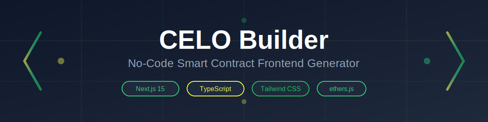
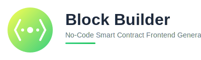
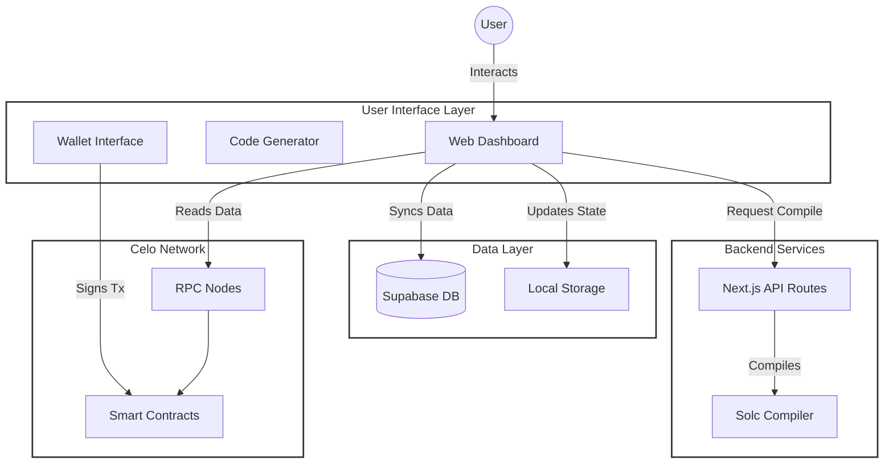

<div align="center">
  
  <!-- Use banner for full-width display or logo for centered display -->
  
  
  <!-- Alternative: Use logo instead
  
  -->
  
  # 🚀 Block Builder
  
  ### *Generate production-ready Next.js frontends from smart contract ABIs in seconds*
  
  **🌐 [Live Demo](https://celobuilder.vercel.app/) • [Builder](https://celobuilder.vercel.app/builder)**
  
  [](https://nextjs.org/)
  [](https://www.typescriptlang.org/)
  [](https://tailwindcss.com/)
  [](https://celo.org/)
  [](https://docs.ethers.org/)
  
  
  
  
  
  
  [](https://celobuilder.vercel.app/)
  
  [Features](#-features) •
  [Quick Start](#-quick-start) •
  [Documentation](#-documentation) •
  [Examples](#-examples)
  
</div>

---

## 🎥 Demo Video

[](https://youtu.be/-GR1HKnp26Q)

**[Click here to watch the full demo video →](https://youtu.be/-GR1HKnp26Q)**

See Block Builder in action! This video demonstrates:

- ✨ Building smart contracts with the visual builder
- 🚀 Deploying contracts to Celo network
- 🎨 Generating frontend applications automatically
- 💰 Requesting testnet tokens from the faucet
- 🔗 Connecting wallets and interacting with contracts

---

##  Screenshots

<div align="center">

### 🏠 Landing Page

_Beautiful, modern landing page with interactive animations_


---

### 🛠️ Builder Interface

_Visual drag-and-drop interface for building smart contracts_


---

### 📦 Project Section

_Manage deployed contracts and generate frontends_


</div>

---

##  About

**Block Builder** is an intelligent no-code/low-code platform that automatically generates fully-functional Next.js dApps from your smart contract ABIs. Deploy a contract, paste the ABI, and get a production-ready frontend with wallet integration, transaction handling, and beautiful UI.

### 🎯 What's Included

| Component                 | Description                                           |
| ------------------------- | ----------------------------------------------------- |
| 🎨 **Builder UI**         | Interactive Next.js app for generating frontends      |
| 🔧 **Code Generator**     | Smart generator in `lib/frontend-generator.ts`        |
| 🔗 **Wallet Integration** | MetaMask + Alchemy dual-provider support              |
| 📊 **Block Explorer**     | Celoscan API integration for tx verification          |
| 🎭 **ABI-Aware UI**       | Automatically detects and renders available functions |

### 📊 Why Use Block Builder?

| Traditional Approach        | With Block Builder          |
| --------------------------- | -------------------------- |
| ⏰ Days of coding           | ⚡ Minutes to generate     |
| 🔧 Manual ABI parsing       | 🤖 Automatic detection     |
| 🎨 Build UI from scratch    | ✨ Beautiful UI included   |
| 🔌 Setup wallet connection  | 🔗 Pre-integrated MetaMask |
| 📝 Write ethers.js code     | 📦 Production-ready code   |
| 🐛 Debug integration issues | ✅ Tested & reliable       |

### 🏆 Key Statistics

<div align="center">
  
| Metric | Value |
|--------|-------|
| ⚡ **Generation Time** | < 5 seconds |
| 📦 **Files Generated** | 10+ ready-to-use files |
| 🎨 **UI Components** | Wallet, Contract, Forms |
| 🔍 **Supported Blocks** | 17 block types (see below) |
| 🌐 **Networks** | Celo Mainnet & Alfajores |
  
</div>

---

## ✨ Features

<details open>
<summary><b>🎨 ABI-Aware Generation</b></summary>

- Automatically detects function signatures (`mint(address)` vs `mint(address, uint256)`)
- Generates UI components only for functions present in your contract
- **17 Supported Block Types:**
  - **Base Contracts:** ERC20 Token, NFT (ERC721)
  - **Token Functions:** Mint, Transfer, Burn
  - **DeFi Features:** Stake, Withdraw
  - **Security:** Pausable, Whitelist, Blacklist, Multi-Signature, Time Lock
  - **NFT Specific:** Royalties
  - **Advanced:** Airdrop, Voting, Snapshot, Gasless Approval (EIP-2612)
- Smart parameter detection and validation
- Fallback ABI generation for contracts without stored ABI

</details>

<details open>
<summary><b>🔌 Dual Provider Architecture</b></summary>

- **Primary**: MetaMask Browser Provider for user transactions
- **Fallback**: Alchemy RPC provider for enhanced reliability
- Automatic network switching and validation
- Seamless provider failover

</details>

<details open>
<summary><b>🔍 Transaction Verification</b></summary>

- Real-time transaction tracking with hash display
- Celoscan API integration for status verification
- Direct links to block explorer
- Success/failure notifications

</details>

<details open>
<summary><b>🎨 Beautiful UI Out-of-the-Box</b></summary>

- Pre-configured Tailwind CSS with dark theme
- Responsive design for mobile and desktop
- Custom components with backdrop blur and shadows
- Smooth transitions and hover effects

</details>

---

## 🗺️ User Journey: From Idea to DApp

**Block Builder** streamlines the web3 development process into a simple, linear flow. Go from a concept to a live application in minutes.

```mermaid
graph LR
    Step1(🏁 Start) --> Step2[🦊 Connect Wallet]
    Step2 --> Step3[🏗️ Drag & Drop Blocks]
    Step3 --> Step4[⚙️ Configure Features]
    Step4 --> Step5[📜 Generate Contract]
    Step5 --> Step6[🚀 Deploy to Celo]
    Step6 --> Step7[💻 Download DApp]
    Step7 --> Step8(🎉 Launch Product)
    
    style Step1 fill:#1e293b,stroke:#0f172a,stroke-width:2px,color:#fff
    style Step2 fill:#fff,stroke:#333,stroke-width:2px
    style Step3 fill:#fff,stroke:#333,stroke-width:2px
    style Step4 fill:#fff,stroke:#333,stroke-width:2px
    style Step5 fill:#fff,stroke:#333,stroke-width:2px
    style Step6 fill:#fff,stroke:#333,stroke-width:2px
    style Step7 fill:#fff,stroke:#333,stroke-width:2px
    style Step8 fill:#1e293b,stroke:#0f172a,stroke-width:2px,color:#fff
```



### 🛣️ The Roadmap

1.  **Connect & Authenticate**: Link your Celo-compatible wallet (MetaMask, Valora, etc.) to get started.
2.  **Visual Building**: Use the drag-and-drop interface to assemble your smart contract logic. Select from 17+ pre-built blocks like *ERC20*, *NFT*, *Staking*, and *Governance*.
3.  **Configuration**: Customize your contract's parameters—name, symbol, supply, and feature-specific settings.
4.  **Auto-Generation**: watch as **Block Builder** writes the Solidity code for you in real-time.
5.  **One-Click Deploy**: Deploy your contract directly to the Celo Blockchain (Mainnet or Alfajores Testnet) without touching the terminal.
6.  **Frontend Creation**: Automatically generate a full Next.js application tailored to your specific contract ABI.
7.  **Launch**: Download your production-ready source code and launch your DApp to the world!

---

## 🚀 Quick Start

### Prerequisites

- ✅ Node.js 18+
- ✅ npm or yarn
- ✅ MetaMask or Web3 wallet

### Installation

**🌐 Try it online: [https://celobuilder.vercel.app/](https://celobuilder.vercel.app/)**

Or run locally:

```powershell
# Clone the repository
git clone https://github.com/ROHIT8759/Low_-_No_Code_Platform_on_CELO.git
cd Low_-_No_Code_Platform_on_CELO

# Install dependencies
npm install

# Start the builder
npm run dev
```

🎉 **Open** http://localhost:3000 in your browser!

---

## 🎯 How to Use

### Step 1: Access the Builder

**🌐 Online:** [https://celobuilder.vercel.app/builder](https://celobuilder.vercel.app/builder)

**💻 Local:** http://localhost:3000/builder

### Step 2: Generate Your Frontend

<table>
<tr>
<td width="50%">

**Option A: Via UI**

1. Paste your contract ABI
2. Enter contract address
3. Select network (Celo/Alfajores)
4. Click **Generate Frontend**
5. Download ZIP file

</td>
<td width="50%">

**Option B: Programmatically**

```typescript
import { generateNextJsFrontend } from './lib/frontend-generator'

const files = generateNextJsFrontend({
  contractName: 'MyToken',
  contractAddress: '0x...',
  abi: [...],
  chainId: 44787,
  networkName: 'alfajores'
})
```

</td>
</tr>
</table>

### Step 3: Run Generated dApp

```powershell
# Extract the ZIP and navigate to the folder
cd mytoken-frontend

# Install dependencies
npm install

# Configure environment variables (see below)
# Edit .env.local

# Start the dApp
npm run dev
```

---

## 🔐 Environment Configuration

Create a `.env.local` file in your generated project:

```env
# Contract Configuration
NEXT_PUBLIC_CONTRACT_ADDRESS=0x1234567890abcdef...
NEXT_PUBLIC_CHAIN_ID=44787
NEXT_PUBLIC_NETWORK_NAME=alfajores

# API Keys (Optional but Recommended)
NEXT_PUBLIC_ALCHEMY_API_KEY=your_alchemy_api_key
NEXT_PUBLIC_BLOCK_EXPLORER_API_KEY=your_celoscan_api_key
NEXT_PUBLIC_BLOCK_EXPLORER_URL=https://celoscan.io
```

<details>
<summary>📚 <b>How to get API keys</b></summary>

### Alchemy API Key

1. Visit [https://www.alchemy.com/](https://www.alchemy.com/)
2. Sign up for free
3. Create a new app → Select **Celo** network
4. Copy API key from dashboard

### Celoscan API Key

1. Visit [https://celoscan.io/](https://celoscan.io/)
2. Sign up for free
3. Navigate to **API Keys** section
4. Generate new API key

</details>

---

## 📚 Documentation

### 🏗️ System Architecture



---

### 📦 Core Modules Deep Dive

#### 1. State Management (`lib/store.ts`)

The application uses **Zustand** for lightweight, performant state management with persistence.

```typescript
// Core State Structure
interface BuilderStore {
  // Project Management
  currentProject: Project | null;
  projects: Project[];

  // Block System (17 types)
  blocks: Block[];
  selectedBlock: Block | null;

  // Wallet Integration
  walletAddress: string | null;
  walletChainId: number | null;

  // Deployed Contracts Registry
  deployedContracts: DeployedContract[];
}

// Block Type Definition
type BlockType =
  | "erc20"
  | "nft" // Base contracts
  | "mint"
  | "transfer"
  | "burn" // Token functions
  | "stake"
  | "withdraw" // DeFi features
  | "pausable"
  | "whitelist"
  | "blacklist"
  | "multisig"
  | "timelock" // Security
  | "royalty" // NFT-specific
  | "airdrop"
  | "voting"
  | "snapshot"
  | "permit"; // Advanced
```

**Key Features:**

- 🔄 **Persistence**: Auto-saves to localStorage via Zustand middleware
- ☁️ **Cloud Sync**: Syncs with Supabase when user is authenticated
- 📊 **Reactive Updates**: Components auto-update on state changes

---

#### 2. Code Generation Pipeline (`lib/code-generator.tsx`)

The code generator transforms visual blocks into deployable Solidity smart contracts.

```
┌─────────────┐     ┌──────────────────┐     ┌─────────────────┐
│   Blocks    │ ──▶ │  Code Generator  │ ──▶ │  Solidity Code  │
│   (Array)   │     │                  │     │   (String)      │
└─────────────┘     └──────────────────┘     └─────────────────┘
       │                    │                        │
       │                    ▼                        ▼
       │           ┌──────────────────┐     ┌─────────────────┐
       │           │ buildCombined    │     │   Deploy via    │
       │           │ Contract()       │     │   ethers.js     │
       │           └──────────────────┘     └─────────────────┘
       │
       ▼
┌─────────────────────────────────────────────────────────────────┐
│                    BLOCK PROCESSING FLOW                        │
├─────────────────────────────────────────────────────────────────┤
│ 1. Find base block (ERC20 or NFT) - Required                    │
│ 2. Collect feature blocks (mint, burn, stake, etc.)             │
│ 3. Generate contract header with SPDX license                   │
│ 4. Add state variables based on features                        │
│ 5. Generate constructor with initialization                     │
│ 6. Add feature functions (conditionally)                        │
│ 7. Add modifiers (onlyOwner, whenNotPaused, etc.)              │
│ 8. Return complete Solidity source code                         │
└─────────────────────────────────────────────────────────────────┘
```

**Feature Injection System:**

```typescript
// Each feature adds specific code segments
const FEATURE_MAPPINGS = {
  mint: {
    stateVars: [],
    functions: ["mint(address to, uint256 amount)"],
    events: ["Mint(address indexed to, uint256 amount)"],
    modifiers: ["onlyOwner"],
  },
  pausable: {
    stateVars: ["bool public paused"],
    functions: ["pause()", "unpause()"],
    events: ["Paused(address account)", "Unpaused(address account)"],
    modifiers: ["whenNotPaused"],
  },
  // ... 15 more features
};
```

---

#### 3. Frontend Generator (`lib/frontend-generator.ts`)

Generates a complete, deployable Next.js application from contract metadata.

```
┌─────────────────────────────────────────────────────────────────┐
│                  GENERATED FILE STRUCTURE                       │
├─────────────────────────────────────────────────────────────────┤
│                                                                 │
│  mytoken-frontend/                                              │
│  ├── app/                                                       │
│  │   ├── layout.tsx          # Root layout with metadata        │
│  │   ├── page.tsx            # Main dApp page                   │
│  │   └── globals.css         # Tailwind + custom styles         │
│  │                                                              │
│  ├── components/                                                │
│  │   ├── WalletConnect.tsx   # MetaMask integration             │
│  │   └── ContractInteraction.tsx  # ABI-aware UI               │
│  │                                                              │
│  ├── lib/                                                       │
│  │   └── contract.ts         # Contract ABI + address           │
│  │                                                              │
│  ├── .env.local              # Environment variables            │
│  ├── package.json            # Dependencies                     │
│  ├── tailwind.config.js      # Styling configuration            │
│  └── tsconfig.json           # TypeScript config                │
│                                                                 │
└─────────────────────────────────────────────────────────────────┘
```

**ABI-Aware UI Generation:**

```typescript
// Dynamically generates UI based on contract functions
function generateContractComponent(contract: DeployedContract): string {
  const hasMint = hasAbiFunction(contract, "mint");
  const hasBurn = hasAbiFunction(contract, "burn");
  const hasTransfer = hasAbiFunction(contract, "transfer");
  // ... generates only relevant UI components
}
```

---

#### 4. Supabase Integration (`lib/supabase.ts` + `supabase-store.ts`)

Cloud storage for user projects and deployed contracts.

```
┌─────────────────────────────────────────────────────────────────┐
│                    DATABASE SCHEMA                              │
├─────────────────────────────────────────────────────────────────┤
│                                                                 │
│  users                        deployed_contracts                │
│  ├── id (UUID, PK)           ├── id (UUID, PK)                 │
│  ├── wallet_address          ├── user_id (FK → users)          │
│  ├── email                   ├── contract_address              │
│  ├── username                ├── contract_name                 │
│  ├── created_at              ├── token_name/symbol             │
│  └── updated_at              ├── network (sepolia/mainnet)     │
│                              ├── chain_id                       │
│  projects                    ├── deployer                       │
│  ├── id (UUID, PK)           ├── deployed_at                   │
│  ├── user_id (FK → users)    ├── transaction_hash              │
│  ├── name                    ├── contract_type                 │
│  ├── description             ├── abi (JSONB)                   │
│  ├── blocks (JSONB)          ├── solidity_code (TEXT)          │
│  ├── contract_type           ├── blocks (JSONB)                │
│  ├── solidity_code           ├── explorer_url                  │
│  ├── frontend_code           ├── frontend_url                  │
│  └── timestamps              └── github_repo                   │
│                                                                 │
└─────────────────────────────────────────────────────────────────┘
```

**Row Level Security (RLS):**

- Users can only access their own data
- Wallet address is used as identity

---

#### 5. Celo Network Configuration (`lib/celo-config.ts`)

Network configurations for Celo blockchain connectivity.

```typescript
const CELO_NETWORKS = {
  sepolia: {
    name: "Celo Sepolia Testnet",
    chainId: 11142220,
    rpcUrl: "https://forno.celo-sepolia.celo-testnet.org/",
    explorerUrl: "https://celo-sepolia.blockscout.com/",
    nativeCurrency: { name: "CELO", symbol: "CELO", decimals: 18 },
  },
  mainnet: {
    name: "Celo Mainnet",
    chainId: 42220,
    rpcUrl: "https://forno.celo.org",
    explorerUrl: "https://celoscan.io",
    nativeCurrency: { name: "CELO", symbol: "CELO", decimals: 18 },
  },
};
```

---

### 🔧 Tech Stack

| Layer              | Technology                 |
| ------------------ | -------------------------- |
| **Framework**      | Next.js 15 with App Router |
| **Language**       | TypeScript 5+              |
| **Styling**        | Tailwind CSS 3             |
| **Blockchain**     | ethers.js 6                |
| **State**          | Zustand (with persist)     |
| **Database**       | Supabase (PostgreSQL)      |
| **RPC Provider**   | Alchemy API / Forno        |
| **Block Explorer** | Celoscan API               |
| **Testing**        | Jest + React Testing Lib   |
| **Compiler**       | solc (via API)             |

---

### 🔄 Data Flow Diagrams

#### Contract Building Flow

```
User Action          State Update           Side Effects
─────────────────────────────────────────────────────────
Drag Block    ──▶   addBlock()      ──▶   • Update blocks[]
                                          • Regenerate Solidity
                                          • Update CodeViewer

Click Deploy  ──▶   setStep()       ──▶   • Compile contract
                                          • Estimate gas
                                          • Send transaction
                                          • Save to Supabase

View Preview  ──▶   setPreview()    ──▶   • Generate iframe
                                          • Load ethers.js
                                          • Connect wallet
```

#### Wallet Connection Flow

```
┌──────────┐     ┌───────────────┐     ┌──────────────┐
│  User    │────▶│   MetaMask    │────▶│  Ethereum    │
│  Click   │     │   Prompt      │     │  Provider    │
└──────────┘     └───────────────┘     └──────┬───────┘
                                              │
                 ┌───────────────────────────┘
                 ▼
┌─────────────────────────────────────────────────────┐
│                  Application State                  │
│  • walletAddress = "0x..."                         │
│  • walletChainId = 44787                           │
│  • Initialize Supabase user                        │
│  • Sync cloud projects                             │
└─────────────────────────────────────────────────────┘
```

---

### 📂 Complete Project Structure

```
d:\HACKATHONS\Celo Hackathon\aaaa\
│
├── 📁 app/                          # Next.js App Router
│   ├── layout.tsx                   # Root layout
│   ├── page.tsx                     # Landing page (/)
│   ├── globals.css                  # Global styles
│   ├── 📁 builder/
│   │   └── page.tsx                 # Builder interface (/builder)
│   ├── 📁 docs/
│   │   └── page.tsx                 # Documentation (/docs)
│   ├── 📁 api/
│   │   └── 📁 compile/
│   │       └── route.ts             # Solidity compilation API
│   └── 📁 test-compile/
│       └── page.tsx                 # Compilation testing
│
├── 📁 components/                   # React Components
│   ├── navbar.tsx                   # Top navigation bar
│   ├── block-sidebar.tsx            # Block selection sidebar (17 blocks)
│   ├── canvas.tsx                   # Drag-drop canvas
│   ├── code-viewer.tsx              # Live Solidity preview
│   ├── deploy-modal.tsx             # Contract deployment wizard
│   ├── preview-modal.tsx            # dApp preview (before deploy)
│   ├── contract-preview-modal.tsx   # Deployed contract preview
│   ├── project-manager.tsx          # Project & contract management
│   ├── faucet-info.tsx              # Testnet faucet information
│   ├── scroll-reveal.tsx            # Animation component
│   └── section-divider.tsx          # UI divider component
│
├── 📁 lib/                          # Core Business Logic
│   ├── store.ts                     # Zustand state management
│   ├── supabase-store.ts            # Supabase sync store
│   ├── supabase.ts                  # Database client & functions
│   ├── code-generator.tsx           # Solidity code generator
│   ├── solidity-templates.ts        # Contract templates
│   ├── frontend-generator.ts        # Next.js dApp generator
│   ├── celo-config.ts               # Network configurations
│   ├── github-deploy.ts             # GitHub deployment
│   ├── useWallet.ts                 # Wallet hook
│   ├── utils.ts                     # Utility functions
│   ├── gemini.ts                    # AI integration (optional)
│   └── gemini-frontend-generator.ts # AI-powered generation
│
├── 📁 __tests__/                    # Jest Test Suites
│   ├── store.test.ts                # State management tests
│   ├── code-generator.test.ts       # Code generation tests
│   ├── celo-config.test.ts          # Network config tests
│   ├── canvas.test.tsx              # Canvas component tests
│   ├── navbar.test.tsx              # Navbar tests
│   ├── block-sidebar.test.tsx       # Sidebar tests
│   └── wallet-connection.test.tsx   # Wallet integration tests
│
├── 📁 supabase/
│   └── schema.sql                   # Database schema
│
├── 📁 public/                       # Static assets
│   └── 📁 assets/
│       ├── banner.svg               # Header banner
│       └── logo.svg                 # Application logo
│
├── 📁 coverage/                     # Test coverage reports
│
├── 📄 Configuration Files
│   ├── package.json                 # Dependencies
│   ├── tsconfig.json                # TypeScript config
│   ├── next.config.ts               # Next.js config
│   ├── tailwind.config.ts           # Tailwind CSS config
│   ├── jest.config.js               # Jest testing config
│   ├── eslint.config.mjs            # ESLint config
│   └── postcss.config.mjs           # PostCSS config
│
└── 📄 Documentation
    └── README.md                    # This file
```

---

### 📋 Complete Block Type Reference

All 17 supported block types with their generated Solidity functions:

| Block Type    | Category         | Generated Functions                                                                                                            | Generated Events                                                      | Modifiers          |
| ------------- | ---------------- | ------------------------------------------------------------------------------------------------------------------------------ | --------------------------------------------------------------------- | ------------------ |
| **erc20**     | Base             | `transfer()`, `approve()`, `transferFrom()`, `balanceOf()`, `totalSupply()`, `name()`, `symbol()`, `decimals()`                | `Transfer`, `Approval`                                                | -                  |
| **nft**       | Base             | `mint()`, `transferFrom()`, `safeTransferFrom()`, `approve()`, `setApprovalForAll()`, `balanceOf()`, `ownerOf()`, `tokenURI()` | `Transfer`, `Approval`, `ApprovalForAll`                              | -                  |
| **mint**      | Token Function   | `mint(address to, uint256 amount)`                                                                                             | `Mint(address indexed to, uint256 amount)`                            | `onlyOwner`        |
| **transfer**  | Token Function   | Enhanced `transfer()` with hooks                                                                                               | `Transfer`                                                            | `whenNotPaused`    |
| **burn**      | Token Function   | `burn(uint256 amount)`, `burnFrom(address, uint256)`                                                                           | `Burn(address indexed from, uint256 amount)`                          | -                  |
| **stake**     | DeFi             | `stake(uint256 amount)`, `getStake(address)`, `totalStaked()`                                                                  | `Staked(address indexed user, uint256 amount)`                        | `whenNotPaused`    |
| **withdraw**  | DeFi             | `withdraw(uint256 amount)`, `withdrawAll()`                                                                                    | `Withdrawn(address indexed user, uint256 amount)`                     | `whenNotPaused`    |
| **pausable**  | Security         | `pause()`, `unpause()`, `paused()`                                                                                             | `Paused(address account)`, `Unpaused(address account)`                | `onlyOwner`        |
| **whitelist** | Security         | `addToWhitelist(address)`, `removeFromWhitelist(address)`, `isWhitelisted(address)`                                            | `AddedToWhitelist`, `RemovedFromWhitelist`                            | `onlyOwner`        |
| **blacklist** | Security         | `addToBlacklist(address)`, `removeFromBlacklist(address)`, `isBlacklisted(address)`                                            | `AddedToBlacklist`, `RemovedFromBlacklist`                            | `onlyOwner`        |
| **multisig**  | Security         | `submitTransaction()`, `confirmTransaction()`, `executeTransaction()`, `revokeConfirmation()`                                  | `TransactionSubmitted`, `TransactionConfirmed`, `TransactionExecuted` | -                  |
| **timelock**  | Security         | `queueTransaction()`, `executeTransaction()`, `cancelTransaction()`, `setDelay()`                                              | `TransactionQueued`, `TransactionExecuted`, `TransactionCancelled`    | `onlyOwner`        |
| **royalty**   | NFT Feature      | `setRoyalty(uint256 percentage)`, `royaltyInfo(uint256 tokenId, uint256 salePrice)`                                            | `RoyaltySet`                                                          | `onlyOwner`        |
| **airdrop**   | Distribution     | `airdrop(address[] recipients, uint256[] amounts)`, `batchAirdrop()`                                                           | `Airdropped(address indexed recipient, uint256 amount)`               | `onlyOwner`        |
| **voting**    | Governance       | `createProposal()`, `vote()`, `executeProposal()`, `getProposal()`                                                             | `ProposalCreated`, `Voted`, `ProposalExecuted`                        | -                  |
| **snapshot**  | Governance       | `createSnapshot()`, `balanceOfAt()`, `totalSupplyAt()`                                                                         | `SnapshotCreated(uint256 snapshotId)`                                 | `onlyOwner`        |
| **permit**    | Gas Optimization | `permit()`, `nonces()`, `DOMAIN_SEPARATOR()`                                                                                   | -                                                                     | EIP-2612 compliant |

---

### 🔌 API Reference

#### Compile API (`/api/compile`)

**POST** `/api/compile`

Compiles Solidity source code using the solc compiler.

```typescript
// Request
{
  sourceCode: string;    // Solidity source code
  contractName: string;  // Name of the main contract
}

// Response (Success)
{
  success: true;
  abi: AbiItem[];        // Contract ABI
  bytecode: string;      // Compiled bytecode
}

// Response (Error)
{
  success: false;
  error: string;         // Compilation error message
}
```

**Example Usage:**

```typescript
const response = await fetch("/api/compile", {
  method: "POST",
  headers: { "Content-Type": "application/json" },
  body: JSON.stringify({
    sourceCode: solidityCode,
    contractName: "MyToken",
  }),
});
const { abi, bytecode } = await response.json();
```

---

### 🔐 Security Architecture

```
┌─────────────────────────────────────────────────────────────────┐
│                    SECURITY LAYERS                               │
├─────────────────────────────────────────────────────────────────┤
│                                                                  │
│  ┌──────────────────────────────────────────────────────────┐  │
│  │ LAYER 1: Client-Side                                      │  │
│  │ • MetaMask signature verification                         │  │
│  │ • Transaction confirmation prompts                        │  │
│  │ • Network validation                                      │  │
│  └──────────────────────────────────────────────────────────┘  │
│                                                                  │
│  ┌──────────────────────────────────────────────────────────┐  │
│  │ LAYER 2: Database (Supabase RLS)                         │  │
│  │ • Row Level Security policies                             │  │
│  │ • Wallet address identity verification                    │  │
│  │ • User-scoped data access                                 │  │
│  └──────────────────────────────────────────────────────────┘  │
│                                                                  │
│  ┌──────────────────────────────────────────────────────────┐  │
│  │ LAYER 3: Smart Contract                                   │  │
│  │ • onlyOwner modifier for admin functions                  │  │
│  │ • whenNotPaused for emergency stops                       │  │
│  │ • Whitelist/Blacklist access control                      │  │
│  │ • Timelock for delayed execution                          │  │
│  │ • Multisig for shared ownership                           │  │
│  └──────────────────────────────────────────────────────────┘  │
│                                                                  │
└─────────────────────────────────────────────────────────────────┘
```

---

### 🚀 Deployment Pipeline

```
┌──────────────┐     ┌──────────────┐     ┌──────────────┐
│   Blocks     │────▶│   Generate   │────▶│   Compile    │
│   Canvas     │     │   Solidity   │     │   (solc)     │
└──────────────┘     └──────────────┘     └──────┬───────┘
                                                  │
                                                  ▼
┌──────────────┐     ┌──────────────┐     ┌──────────────┐
│   Save to    │◀────│   Verify on  │◀────│   Deploy     │
│   Supabase   │     │   Celoscan   │     │   (ethers)   │
└──────────────┘     └──────────────┘     └──────────────┘
       │
       ▼
┌──────────────────────────────────────────────────────────┐
│                POST-DEPLOYMENT ACTIONS                    │
├──────────────────────────────────────────────────────────┤
│ • Generate frontend dApp (14 files)                       │
│ • Create GitHub repository (optional)                     │
│ • Deploy to Vercel (optional)                             │
│ • Store contract metadata in database                     │
└──────────────────────────────────────────────────────────┘
```

---

### 📊 Component Interaction Map

```
                              ┌─────────────────┐
                              │     Navbar      │
                              │  (wallet state) │
                              └────────┬────────┘
                                       │
                     ┌─────────────────┼─────────────────┐
                     ▼                 ▼                 ▼
            ┌────────────────┐ ┌────────────────┐ ┌────────────────┐
            │ BlockSidebar   │ │    Canvas      │ │  CodeViewer    │
            │ (block types)  │ │  (block state) │ │  (generated)   │
            └───────┬────────┘ └───────┬────────┘ └────────────────┘
                    │                  │
                    │    drag/drop     │
                    └──────────────────┘
                              │
                              ▼
                    ┌────────────────────┐
                    │       Store        │
                    │  (Zustand state)   │
                    │  • blocks[]        │
                    │  • projects[]      │
                    │  • deployedContracts │
                    └─────────┬──────────┘
                              │
           ┌──────────────────┼──────────────────┐
           ▼                  ▼                  ▼
    ┌─────────────┐   ┌─────────────┐   ┌─────────────────────┐
    │DeployModal  │   │PreviewModal │   │ContractPreviewModal │
    │(compile &   │   │(before      │   │(after deploy)       │
    │ deploy)     │   │ deploy)     │   │                     │
    └─────────────┘   └─────────────┘   └─────────────────────┘
```

---

## 📸 Demo

<div align="center">
  
  ### 🎬 Watch it in Action
  
  <!-- Add your demo GIF here -->
  <!--  -->
  
  <table>
    <tr>
      <td width="50%">
        <h4>📝 Builder Interface</h4>
        <p><i>Paste your ABI and generate instantly</i></p>
        <!--  -->
      </td>
      <td width="50%">
        <h4>🎨 Generated Frontend</h4>
        <p><i>Beautiful UI out of the box</i></p>
        <!--  -->
      </td>
    </tr>
  </table>
  
  > 💡 **Tip**: Add screenshots to `public/assets/` and uncomment the image tags above!
  
</div>

---

## 🎓 Examples

### Example 1: ERC-20 Token

<details>
<summary>Click to expand</summary>

**Contract Functions:**

- `mint(address, uint256)` ✅
- `burn(uint256)` ✅
- `transfer(address, uint256)` ✅
- `balanceOf(address)` ✅

**Generated UI:**

- Amount input for minting
- Burn tokens interface
- Transfer to address form
- Real-time balance display

</details>

### Example 2: NFT Contract

<details>
<summary>Click to expand</summary>

**Contract Functions:**

- `mint(address)` ✅ (no amount parameter)
- `tokenURI(uint256)` ✅
- `balanceOf(address)` ✅

**Generated UI:**

- Simple mint button (no amount input)
- NFT balance counter
- Metadata viewer

</details>

---

## ✅ Smoke Test Checklist

Run through these steps to verify your generated dApp:

- [ ] **Setup**

  - [ ] Add Alchemy API key to `.env.local`
  - [ ] Add Celoscan API key to `.env.local`
  - [ ] Run `npm install`
  - [ ] Run `npm run dev`

- [ ] **Wallet Connection**

  - [ ] Open http://localhost:3000
  - [ ] Click "Connect Wallet"
  - [ ] MetaMask prompts for connection
  - [ ] Network auto-switches if needed
  - [ ] Wallet address displays

- [ ] **Balance Display**

  - [ ] Token balance loads automatically
  - [ ] Refresh button updates balance

- [ ] **Mint Function**

  - [ ] Amount input appears (if mint accepts amount)
  - [ ] OR simple button appears (if mint is address-only)
  - [ ] Click mint
  - [ ] Transaction hash displays
  - [ ] Link to Celoscan works
  - [ ] Balance updates after confirmation

- [ ] **Transfer Function**
  - [ ] Enter recipient address
  - [ ] Enter amount
  - [ ] Transaction succeeds
  - [ ] Balance decreases

---

## 🛠️ Development

### For Maintainers

The generator logic lives in `lib/frontend-generator.ts`. Key functions:

```typescript
// Main entry point
generateNextJsFrontend(contract: DeployedContract): FrontendFiles

// ABI helper
hasAbiFunction(contract: DeployedContract, name: string): boolean

// Component generators
generateLayout(contract)
generateMainPage(contract)
generateContractLib(contract)
generateWalletComponent(contract)
generateContractComponent(contract)  // ⭐ ABI-aware UI generation
```

### Running Tests

```powershell
# Type check
npx tsc --noEmit

# Lint
npm run lint

# Build
npm run build
```

---

## 🚦 Roadmap

- [x] ABI-aware function generation
- [x] Dual provider (MetaMask + Alchemy)
- [x] Celoscan transaction verification
- [x] Tailwind CSS integration
- [x] TypeScript support
- [x] 17 smart contract block types
- [x] Contract preview & interaction modal
- [x] Supabase cloud storage integration
- [x] Fallback ABI generation
- [x] Multi-signature block support
- [x] Automated testing suite (Jest)
- [ ] Event viewer component
- [ ] ERC-721 metadata display
- [ ] CI/CD pipeline

---

## 🤝 Contributing

Contributions are welcome! Here's how you can help:

1. 🍴 Fork the repository
2. 🌿 Create a feature branch (`git checkout -b feature/amazing-feature`)
3. 💾 Commit your changes (`git commit -m 'Add amazing feature'`)
4. 📤 Push to the branch (`git push origin feature/amazing-feature`)
5. 🎉 Open a Pull Request

---

## 📝 License

This project is licensed under the MIT License.

---

## 🙏 Acknowledgments

- **Celo Foundation** for the amazing blockchain infrastructure
- **Alchemy** for reliable RPC endpoints
- **Celoscan** for block explorer APIs
- **Next.js Team** for the incredible framework
- **ethers.js** for Ethereum interactions

---

## 📧 Support & Contact

- 🐛 **Issues**: [GitHub Issues](https://github.com/ROHIT8759/Low_-_No_Code_Platform_on_CELO/issues)
- 💬 **Discussions**: [GitHub Discussions](https://github.com/ROHIT8759/Low_-_No_Code_Platform_on_CELO/discussions)
- 📧 **Email**: Contact via GitHub profile

---

<div align="center">
  
  ### ⭐ Star this repo if you find it useful!
  
  Made with ❤️ for the Celo ecosystem
  
  [⬆ Back to Top](#-lowno-code-platform-on-celo)
  
</div>
